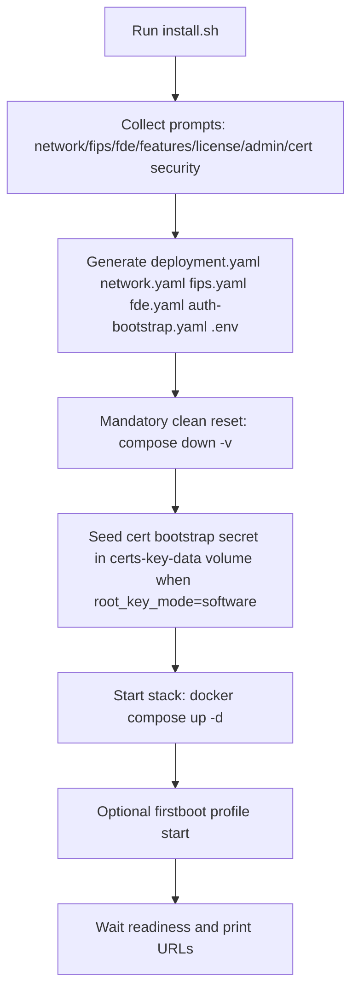
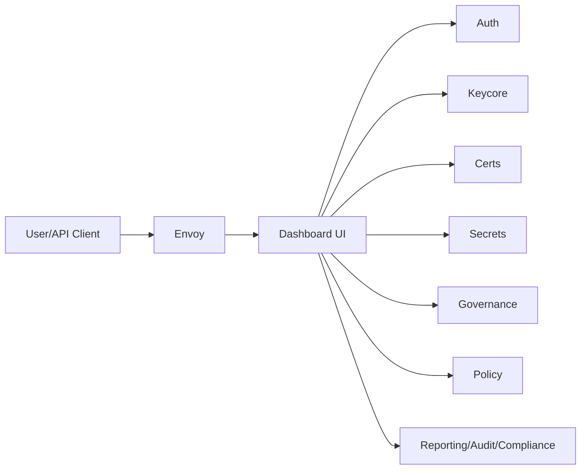
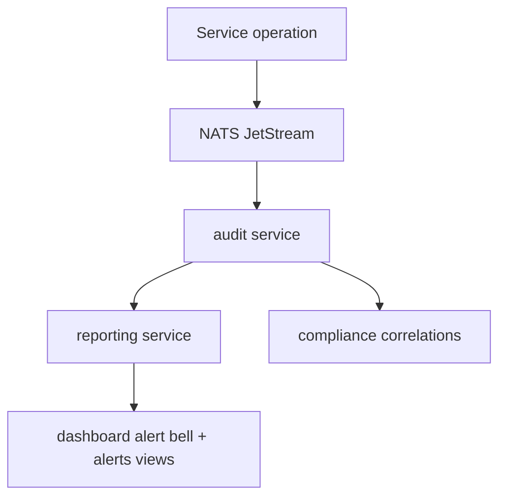
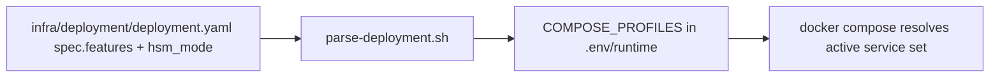

# Vecta KMS Runtime and Control Flow (Current Repo State)

This document describes the **actual runtime flow** and **control flow** of the KMS elements that exist now in this repository.

## Source References

- `docker-compose.yml`
- `infra/deployment/deployment.schema.json`
- `infra/scripts/parse-deployment.sh`
- `install.sh`
- `services/*/handler.go`
- `services/firstboot/wizard.go`
- `services/certs/main.go`
- `services/certs/root_key_provider.go`

## 1. Runtime Elements Inventory

### 1.1 Always-On Core (no feature profile required)

| Service | Purpose | Default Ports |
|---|---|---|
| `postgres` | Primary relational store | `5432` |
| `nats` | Event bus / JetStream | `4222`, `8222` |
| `valkey` | Cache/session/cache-like lookups | `6379` |
| `consul` | Service registry/health | `8500`, `8502`, `8600/udp` |
| `envoy` | Edge ingress TLS/API gateway | `80`, `443`, `5696`, `9901` |
| `dashboard` | Web UI | `5173` |
| `auth` | Identity, users, tenants, password policy | `8001`, `18001` |
| `keycore` | Key lifecycle and crypto ops core | `8010`, `18010` |
| `audit` | Audit/event ingest and alerts feed | `8070`, `18070` |
| `policy` | Policy CRUD + evaluate | `8040`, `18040` |

### 1.2 Feature-Gated Services (via `deployment.yaml` → `COMPOSE_PROFILES`)

| Feature Flag | Compose Profile | Service(s) |
|---|---|---|
| `secrets` | `secrets` | `secrets` |
| `certs` | `certs` | `certs` |
| `governance` | `governance` | `governance` |
| `cloud_byok` | `cloud_byok` | `cloud` |
| `hyok_proxy` | `hyok_proxy` | `hyok` |
| `kmip_server` | `kmip_server` | `kmip` |
| `qkd_interface` | `qkd_interface` | `qkd` |
| `ekm_database` | `ekm_database` | `ekm` |
| `payment_crypto` | `payment_crypto` | `payment` |
| `compliance_dashboard` | `compliance_dashboard` | `compliance` |
| `sbom_cbom` | `sbom_cbom` | `sbom` |
| `reporting_alerting` | `reporting_alerting` | `reporting` |
| `ai_llm` | `ai_llm` | `ai` |
| `pqc_migration` | `pqc_migration` | `pqc` |
| `crypto_discovery` | `crypto_discovery` | `discovery` |
| `mpc_engine` | `mpc_engine` | `mpc` |
| `data_protection` | `data_protection` | `dataprotect` |
| `clustering` | `clustering` | `etcd`, `cluster-manager` |

### 1.3 Optional Bootstrap and Crypto-Provider Profiles

| Profile | Service | Notes |
|---|---|---|
| `firstboot` | `firstboot` | Optional wizard UI at `/wizard` |
| `hsm_hardware` | `hsm-connector` | External HSM connector runtime |
| `hsm_software` | `software-vault` | Software crypto provider runtime |

## 2. Install and Startup Control Flow



### Startup behavior details

1. `install.sh` resolves features into compose profiles using `infra/scripts/parse-deployment.sh`.
2. It writes all config files used by runtime.
3. It always performs a clean reset for empty DB on new install flow.
4. For cert DB-encrypted mode + software root key mode, it seeds bootstrap secret into Docker volume before services start.
5. `certs` service initializes CRWK provider and runtime cert materializer.
6. `envoy` waits for runtime cert files from tmpfs volume before starting listener.

## 3. Primary Runtime Request Flows

### 3.1 UI/API ingress path



### 3.2 Auth and authorization control flow

1. Client authenticates through `auth` endpoints.
2. JWT/session context is returned.
3. Downstream protected endpoints validate tenant/user/role/permission.
4. User management, password policy, local user lifecycle, tenant/role management are controlled in `auth`.

### 3.3 Key lifecycle and crypto operations flow

1. Key create/import/form/rotate/activate/deactivate/destroy/export flows are handled by `keycore`.
2. Crypto operations (`encrypt/decrypt/sign/verify/wrap/unwrap/mac/derive/kem/hash/random`) are executed in `keycore`.
3. Governance settings can gate sensitive operations via approval checks.
4. Operation metering and usage limit checks are enforced on key usage paths.

### 3.4 Governance approval queue flow

1. Sensitive action emits/creates governance request.
2. Request appears in governance queue (`/governance/requests*`).
3. Approver votes approve/deny.
4. Final state unlocks or blocks target operation.
5. Governance settings also include SMTP/challenge workflows and system state settings.

### 3.5 Certificates/PKI flow

1. CA and cert issuance handled in `certs` (`/certs/ca`, `/certs`, `/certs/sign-csr`).
2. Renewal/revocation/download and OCSP/CRL handled in `certs`.
3. Protocol handlers exist for ACME, EST, SCEP, CMPv2.
4. Third-party cert upload path exists.
5. Internal runtime certs are materialized periodically by `certs` service.

### 3.6 Secrets vault flow

1. Secret CRUD in `secrets` service.
2. Vault-compatible API paths are exposed (`/v1/...`) for interoperability.
3. Secret access and mutation are audited.

### 3.7 Data protection flow

1. Tokenization/detokenization and token vault management in `dataprotect`.
2. FPE, mask, redact, field/envelope/searchable encryption paths in `dataprotect`.
3. Policy-based masking/redaction endpoints supported.

### 3.8 Payment crypto flow

1. Payment key lifecycle under `/payment/keys*`.
2. TR-31 create/parse/translate/validate paths.
3. PIN, PVV, offset, CVV, MAC, and ISO20022 security endpoints.
4. Operations emit audit events for traceability.

### 3.9 BYOK/HYOK/KMIP/QKD/EKM flows

- `cloud` (`BYOK`): connector accounts, inventory, sync/import/rotate bindings.
- `hyok`: DKE/tenant-held key proxy endpoints (Microsoft and others).
- `kmip`: KMIP server + profile/client management API.
- `qkd`: ETSI/open API endpoints, key pool and inject flow.
- `ekm`: TDE/agent lifecycle, deploy package, heartbeat, logs, key wrap/unwrap/rotate.

### 3.10 Compliance/Reporting/SBOM/AI/Discovery/PQC/MPC flows

- `compliance`: posture, framework checks, key hygiene, assessment schedule/run.
- `reporting`: alerts, incidents, alert rules/channels, report generation/download.
- `sbom`: SBOM/CBOM generation, export, diff, vulnerability views.
- `ai`: query/explain/recommend incident and posture.
- `discovery`: scan crypto assets, classify, summarize.
- `pqc`: readiness scans, migration planning/execution.
- `mpc`: DKG/sign/decrypt ceremonies, shares and key operations.

## 4. Event and Alert Control Flow



Expected runtime behavior is event-driven for auditability and cross-service visibility.

## 5. Certificate Runtime Security Flow (Current)

```mermaid
flowchart TD
  P[Bootstrap passphrase file in certs-key-data volume] --> CRWK[certs root key provider]
  CRWK --> S[/var/lib/vecta/certs/crwk.sealed]
  CRWK --> W[Wrap/unwrap DEK for CA signer/private key envelope]
  certs --> T[/run/vecta/certs tmpfs materialization]
  T --> V[runtime-certs volume]
  V --> E[envoy reads runtime TLS files read-only]
```

Notes:

- `crwk.sealed` remains in Docker volume path (`/var/lib/vecta/certs`), not plaintext in DB.
- Runtime cert materialization path is tmpfs-backed volume (`runtime-certs`), not persistent disk.
- If root key mode is `hsm`, provider is intentionally pending until HSM integration/config is completed.

## 6. Feature Enable/Disable Control Flow



If a feature flag is false, corresponding profile service is not started.

## 7. Service Capability Map (By Element)

| Element | Main API/Control Responsibility |
|---|---|
| `auth` | login/register/users/tenants/password policy/CLI session |
| `keycore` | keys + crypto primitives + tags + usage/approval |
| `audit` | audit ingest/search/stats + base alert APIs |
| `policy` | policy CRUD/versioning/evaluation |
| `secrets` | secret vault + Vault-compatible paths |
| `certs` | CA/cert lifecycle + protocols + OCSP/CRL + runtime cert materializer |
| `governance` | approvals, policy gates, SMTP/system settings |
| `cloud` | BYOK connector registration/sync/import/rotate |
| `hyok` | DKE/HYOK protocol endpoints |
| `kmip` | KMIP client/profile management + KMIP server runtime |
| `qkd` | ETSI QKD and key injection endpoints |
| `ekm` | agent lifecycle, TDE support endpoints, SDK downloads |
| `payment` | TR-31/PIN/CVV/MAC/ISO20022 operations |
| `compliance` | posture/assessment/framework checks and exports |
| `sbom` | SBOM/CBOM generation/history/export/diff |
| `reporting` | alert center, incidents, report jobs/templates |
| `ai` | query/explain/analyze/recommend configs |
| `pqc` | readiness and migration plan workflows |
| `discovery` | crypto discovery scans and asset classification |
| `mpc` | DKG/threshold sign/decrypt/share control |
| `dataprotect` | tokenize/mask/redact and app data encryption |
| `cluster-manager` + `etcd` | clustering control plane |
| `hsm-connector` / `software-vault` | cryptographic provider mode backends |
| `firstboot` | optional setup UI fallback at `/wizard` |

## 8. First-Boot Wizard Usage Scenarios

First-boot is **optional** in current installer flow and is useful when:

1. You need guided config preview/apply from browser UI.
2. You deploy appliance-like environments and want day-0 setup UI.
3. You need to regenerate config files in controlled workflow.

For scripted clean installs, `install.sh` is sufficient and first-boot can remain disabled.

