# Generated Product Map

Generated at `2026-05-10T16:35:18Z` by `scripts/generate_product_map.py`.

This file is generated from source. Re-run the script after UI or API changes.

## Summary

- Dashboard navigation items: `42`
- Tab/component mappings: `50`
- Sub-pane groups: `8`
- Backend HTTP routes discovered: `945` across `34` services
- Frontend API call sites discovered: `629`
- Frontend call sites with exact backend route match: `607`
- Frontend call sites needing review or dynamic/runtime confirmation: `22`
- Clickable controls with static `onClick` handlers: `915`
- Backend request flows with handler/service/package summaries: `945`

## How To Use This For Launch

1. Start with `Navigation To Services` and pick one product tab.
2. Review its service dependencies and then open the linked component/support files.
3. Use `Frontend Calls Needing Review` to find clicks that may hit missing, aliased, dynamic, or unimplemented routes.
4. Use `Backend Routes Not Directly Called From Dashboard` to decide whether each route is API-only, hidden behind a workflow, or dead weight.
5. Pair this static map with Playwright smoke tests and runtime request logging before launch.

## Visual Service Map

```mermaid
flowchart LR
  UI[Dashboard UI]
  tab_home["Dashboard"]
  UI --> tab_home
  tab_home --> svc_audit
  tab_home --> svc_auth_edge
  tab_home --> svc_certs
  tab_home --> svc_cluster_manager
  tab_home --> svc_compliance
  tab_home --> svc_governance
  tab_home --> svc_keycore
  tab_home --> svc_reporting
  tab_home --> svc_secrets
  tab_keys["Key Management"]
  UI --> tab_keys
  tab_keys --> svc_auth
  tab_keys --> svc_keycore
  tab_ops_metrics["Operations Metrics"]
  UI --> tab_ops_metrics
  tab_ops_metrics --> svc_audit
  tab_certs["Certificates / PKI"]
  UI --> tab_certs
  tab_certs --> svc_certs
  tab_ekm["Enterprise Key Management"]
  UI --> tab_ekm
  tab_ekm --> svc_ekm
  tab_ekm --> svc_tfe
  tab_vault["Secret Vault"]
  UI --> tab_vault
  tab_vault --> svc_auth_edge
  tab_vault --> svc_secrets
  tab_rotation["Rotation Scheduler"]
  UI --> tab_rotation
  tab_rotation --> svc_keycore
  tab_ct_monitor["CT Log Monitor"]
  UI --> tab_ct_monitor
  tab_ct_monitor --> svc_certs
  tab_escrow["Key Escrow"]
  UI --> tab_escrow
  tab_escrow --> svc_keycore
  tab_envelope_enc["Envelope Encryption"]
  UI --> tab_envelope_enc
  tab_envelope_enc --> svc_keycore
  tab_tfe["File Encryption (TFE)"]
  UI --> tab_tfe
  tab_tfe --> svc_ekm
  tab_tfe --> svc_tfe
  tab_hsm["HSM"]
  UI --> tab_hsm
  tab_hsm --> svc_auth
  tab_qkd["QKD Interface"]
  UI --> tab_qkd
  tab_qkd --> svc_auth_edge
  tab_qkd --> svc_qkd
  tab_qrng["QRNG Entropy"]
  UI --> tab_qrng
  tab_qrng --> svc_auth_edge
  tab_qrng --> svc_qrng
  tab_mpc["MPC Engine"]
  UI --> tab_mpc
  tab_mpc --> svc_auth
  tab_mpc --> svc_mpc
  tab_cluster["Cluster"]
  UI --> tab_cluster
  tab_cluster --> svc_auth_edge
  tab_cluster --> svc_cluster_manager
  tab_ceremony["Key Ceremony"]
  UI --> tab_ceremony
  tab_ceremony --> svc_keycore
  tab_mtls_mesh["mTLS Mesh"]
  UI --> tab_mtls_mesh
  tab_mtls_mesh --> svc_certs
  tab_dr_drill["DR Drill"]
  UI --> tab_dr_drill
  tab_dr_drill --> svc_keycore
  tab_backup["Backup & Restore"]
  UI --> tab_backup
  tab_backup --> svc_backup
  tab_approvals["Approvals"]
  UI --> tab_approvals
  tab_approvals --> svc_governance
  tab_alerts["Alert Center"]
  UI --> tab_alerts
  tab_alerts --> svc_auth_edge
  tab_alerts --> svc_reporting
  tab_audit["Audit Log"]
  UI --> tab_audit
  tab_audit --> svc_audit
  tab_dspm["Data Security Posture"]
  UI --> tab_dspm
  tab_dspm --> svc_compliance
  tab_dspm --> svc_discovery
  tab_data_activity["Data Activity Monitor"]
  UI --> tab_data_activity
  tab_data_activity --> svc_dam
  tab_posture["Posture Management"]
  UI --> tab_posture
  tab_posture --> svc_auth
  tab_posture --> svc_autokey
  tab_posture --> svc_keyaccess
  tab_posture --> svc_mpc
  tab_posture --> svc_posture
  tab_posture --> svc_signing
  tab_posture --> svc_workload
  tab_compliance["Compliance"]
  UI --> tab_compliance
  tab_compliance --> svc_auth
  tab_compliance --> svc_autokey
  tab_compliance --> svc_certs
  tab_compliance --> svc_compliance
  tab_compliance --> svc_keyaccess
  tab_compliance --> svc_keycore
  tab_compliance --> svc_mpc
  tab_compliance --> svc_pqc
  tab_compliance --> svc_reporting
  tab_compliance --> svc_signing
  tab_compliance --> svc_workload
  tab_sbom["SBOM / CBOM"]
  UI --> tab_sbom
  tab_sbom --> svc_sbom
  tab_crypto_agility["Crypto Agility"]
  UI --> tab_crypto_agility
  tab_crypto_agility --> svc_keycore
  tab_leak_scanner["Leak Scanner"]
  UI --> tab_leak_scanner
  tab_leak_scanner --> svc_posture
  tab_lineage["Source Traceability"]
  UI --> tab_lineage
  tab_lineage --> svc_discovery
  tab_ai["AI Assistant"]
  UI --> tab_ai
  tab_ai --> svc_ai
  tab_ai --> svc_audit
  tab_ai --> svc_auth_edge
  tab_ai_gateway["AI Security Gateway"]
  UI --> tab_ai_gateway
  tab_ai_gateway --> svc_ai
  tab_ai_gateway --> svc_ai_gateway
  tab_webhooks["Webhooks & SIEM"]
  UI --> tab_webhooks
  tab_webhooks --> svc_audit
  tab_byok["byok"]
  UI --> tab_byok
  tab_byok --> svc_cloud
  tab_crypto["crypto"]
  UI --> tab_crypto
  tab_crypto --> svc_keycore
  tab_hyok["hyok"]
  UI --> tab_hyok
  tab_hyok --> svc_hyok
  tab_payment["payment"]
  UI --> tab_payment
  tab_payment --> svc_payment
  tab_pkcs11["pkcs11"]
  UI --> tab_pkcs11
  tab_pkcs11 --> svc_auth_edge
  tab_pkcs11 --> svc_ekm
  tab_pkcs11 --> svc_tfe
  tab_restapi["restapi"]
  UI --> tab_restapi
  tab_restapi --> svc_auth
  tab_restapi --> svc_auth_edge
  tab_restapi --> svc_certs
  tab_restapi --> svc_secrets
  svc_ai["ai (13 routes)"]
  svc_ai_gateway["ai-gateway (31 routes)"]
  svc_audit["audit (43 routes)"]
  svc_auth["auth (81 routes)"]
  svc_auth_edge["auth-edge"]
  svc_autokey["autokey (15 routes)"]
  svc_backup["backup (11 routes)"]
  svc_certs["certs (76 routes)"]
  svc_cloud["cloud (11 routes)"]
  svc_cluster_manager["cluster-manager (18 routes)"]
  svc_compliance["compliance (42 routes)"]
  svc_dam["dam (6 routes)"]
  svc_discovery["discovery (26 routes)"]
  svc_ekm["ekm (61 routes)"]
  svc_governance["governance (36 routes)"]
  svc_hyok["hyok (21 routes)"]
  svc_keyaccess["keyaccess (9 routes)"]
  svc_keycore["keycore (118 routes)"]
  svc_mpc["mpc (31 routes)"]
  svc_payment["payment (42 routes)"]
  svc_posture["posture (19 routes)"]
  svc_pqc["pqc (16 routes)"]
  svc_qkd["qkd (22 routes)"]
  svc_qrng["qrng (10 routes)"]
  svc_reporting["reporting (33 routes)"]
  svc_sbom["sbom (18 routes)"]
  svc_secrets["secrets (22 routes)"]
  svc_signing["signing (11 routes)"]
  svc_tfe["tfe (14 routes)"]
  svc_workload["workload (16 routes)"]
```

A standalone Mermaid file is also written to `docs/generated/product-map.mmd`.

## Navigation To Services

| Group | UI item | Tab id | Component | Service dependencies | Static call sites |
| --- | --- | --- | --- | --- | --- |
| CORE | Dashboard | home | web/dashboard/src/components/v3/tabs/DashboardTab.tsx | audit, auth-edge, certs, cluster-manager, compliance, governance, keycore, reporting, secrets | 182 |
| CORE | Key Management | keys | web/dashboard/src/components/v3/tabs/KeysTab.tsx | auth, keycore | 87 |
| CORE | Operations Metrics | ops_metrics | web/dashboard/src/components/v3/tabs/OpsMetricsTab.tsx | audit | 5 |
| CORE | Certificates / PKI | certs | web/dashboard/src/components/v3/tabs/CertsTab.tsx | certs | 45 |
| CORE | Cloud Key Control | cloudctl | web/dashboard/src/components/v3/tabs/CloudKeyControlTab.tsx | - | 0 |
| CORE | Enterprise Key Management | ekm | web/dashboard/src/components/v3/tabs/EKMTab.tsx | ekm, tfe | 45 |
| CORE | Secret Vault | vault | web/dashboard/src/components/v3/tabs/VaultTab.tsx | auth-edge, secrets | 14 |
| CORE | Data Protection | dataprotection | web/dashboard/src/components/v3/tabs/DataProtectionTabs.tsx | - | 0 |
| WORKBENCH | Workbench | workbench | web/dashboard/src/components/v3/tabs/WorkbenchTab.tsx | - | 0 |
| SECRETS & CERTS | Rotation Scheduler | rotation | web/dashboard/src/components/v3/tabs/RotationSchedulerTab.tsx | keycore | 7 |
| SECRETS & CERTS | CT Log Monitor | ct_monitor | web/dashboard/src/components/v3/tabs/CTMonitorTab.tsx | certs | 7 |
| SECRETS & CERTS | Key Escrow | escrow | web/dashboard/src/components/v3/tabs/EscrowTab.tsx | keycore | 52 |
| SECRETS & CERTS | Canary Keys | canary | web/dashboard/src/components/v3/tabs/CanaryKeysTab.tsx | - | 0 |
| DATA PROTECTION | Envelope Encryption | envelope_enc | web/dashboard/src/components/v3/tabs/EnvelopeEncTab.tsx | keycore | 7 |
| DATA PROTECTION | File Encryption (TFE) | tfe | web/dashboard/src/components/v3/tabs/TFETab.tsx | ekm, tfe | 49 |
| INFRASTRUCTURE | HSM | hsm | web/dashboard/src/components/v3/tabs/HSMTab.tsx | auth | 45 |
| INFRASTRUCTURE | QKD Interface | qkd | web/dashboard/src/components/v3/tabs/QKDTab.tsx | auth-edge, qkd | 17 |
| INFRASTRUCTURE | QRNG Entropy | qrng | web/dashboard/src/components/v3/tabs/QRNGTab.tsx | auth-edge, qrng | 10 |
| INFRASTRUCTURE | MPC Engine | mpc | web/dashboard/src/components/v3/tabs/MPCTab.tsx | auth, mpc | 66 |
| INFRASTRUCTURE | Cluster | cluster | web/dashboard/src/components/v3/tabs/ClusterTab.tsx | auth-edge, cluster-manager | 13 |
| INFRASTRUCTURE | Key Ceremony | ceremony | web/dashboard/src/components/v3/tabs/KeyCeremonyTab.tsx | keycore | 9 |
| INFRASTRUCTURE | mTLS Mesh | mtls_mesh | web/dashboard/src/components/v3/tabs/MTLSMeshTab.tsx | certs | 6 |
| INFRASTRUCTURE | DR Drill | dr_drill | web/dashboard/src/components/v3/tabs/DRDrillTab.tsx | keycore | 7 |
| INFRASTRUCTURE | Backup & Restore | backup | web/dashboard/src/components/v3/tabs/BackupTab.tsx | backup | 10 |
| GOVERNANCE | Approvals | approvals | web/dashboard/src/components/v3/tabs/GovernanceTab.tsx | governance | 20 |
| GOVERNANCE | Alert Center | alerts | web/dashboard/src/components/v3/tabs/AlertsTab.tsx | auth-edge, reporting | 26 |
| GOVERNANCE | Audit Log | audit | web/dashboard/src/components/v3/tabs/AuditLogTab.tsx | audit | 15 |
| GOVERNANCE | Data Security Posture | dspm | web/dashboard/src/components/v3/tabs/DSPMTab.tsx | compliance, discovery | 24 |
| GOVERNANCE | Data Activity Monitor | data_activity | web/dashboard/src/components/v3/tabs/DataActivityTab.tsx | dam | 5 |
| GOVERNANCE | Posture Management | posture | web/dashboard/src/components/v3/tabs/PostureTab.tsx | auth, autokey, keyaccess, mpc, posture, signing, workload | 112 |
| GOVERNANCE | Compliance | compliance | web/dashboard/src/components/v3/tabs/ComplianceTab.tsx | auth, autokey, certs, compliance, keyaccess, keycore, mpc, pqc, reporting, signing, workload | 194 |
| GOVERNANCE | SBOM / CBOM | sbom | web/dashboard/src/components/v3/tabs/SBOMTab.tsx | sbom | 16 |
| GOVERNANCE | Crypto Agility | crypto_agility | web/dashboard/src/components/v3/tabs/CryptoAgilityTab.tsx | keycore | 6 |
| GOVERNANCE | Leak Scanner | leak_scanner | web/dashboard/src/components/v3/tabs/LeakScannerTab.tsx | posture | 7 |
| GOVERNANCE | Source Traceability | lineage | web/dashboard/src/components/v3/tabs/LineageTab.tsx | discovery | 14 |
| GOVERNANCE | Playbooks | playbooks | web/dashboard/src/components/v3/tabs/PlaybooksTab.tsx | - | 0 |
| AI | AI Assistant | ai | web/dashboard/src/components/v3/tabs/AITab.tsx | ai, audit, auth-edge | 11 |
| AI | AI Security Gateway | ai_gateway | web/dashboard/src/components/v3/tabs/AIGatewayTab.tsx | ai, ai-gateway | 26 |
| ADMIN | Administration | admin | web/dashboard/src/components/v3/tabs/AdminTab.tsx | - | 0 |
| ADMIN | Webhooks & SIEM | webhooks | web/dashboard/src/components/v3/tabs/WebhooksTab.tsx | audit | 6 |
| ADMIN | DevSecOps / IaC | devsecops | web/dashboard/src/components/v3/tabs/DevSecOpsTab.tsx | - | 0 |
| ADMIN | Documentation | docs | web/dashboard/src/components/v3/tabs/DocsViewTab.tsx | - | 0 |
| UNLISTED | byok | byok | web/dashboard/src/components/v3/tabs/BYOKTab.tsx | cloud | 10 |
| UNLISTED | crypto | crypto | web/dashboard/src/components/v3/tabs/CryptoTab.tsx | keycore | 42 |
| UNLISTED | dataenc | dataenc | web/dashboard/src/components/v3/tabs/DataProtectionTabs.tsx | - | 0 |
| UNLISTED | hyok | hyok | web/dashboard/src/components/v3/tabs/HYOKTab.tsx | hyok | 7 |
| UNLISTED | payment | payment | web/dashboard/src/components/v3/tabs/PaymentTab.tsx | payment | 27 |
| UNLISTED | pkcs11 | pkcs11 | web/dashboard/src/components/v3/tabs/PKCS11Tab.tsx | auth-edge, ekm, tfe | 49 |
| UNLISTED | restapi | restapi | web/dashboard/src/components/v3/tabs/RestAPITab.tsx | auth, auth-edge, certs, secrets | 104 |
| UNLISTED | tokenize | tokenize | web/dashboard/src/components/v3/tabs/DataProtectionTabs.tsx | - | 0 |

## Backend Route Counts

| Service | Routes | Frontend call sites |
| --- | --- | --- |
| ai | 13 | 9 |
| ai-gateway | 31 | 23 |
| audit | 43 | 27 |
| auth | 81 | 45 |
| autokey | 15 | 11 |
| backup | 11 | 10 |
| certs | 76 | 59 |
| cloud | 11 | 10 |
| cluster-manager | 18 | 9 |
| compliance | 42 | 18 |
| confidential | 6 | 6 |
| dam | 6 | 5 |
| dataprotect | 45 | 28 |
| discovery | 26 | 20 |
| ekm | 61 | 44 |
| governance | 36 | 25 |
| hyok | 21 | 7 |
| keyaccess | 9 | 6 |
| keycore | 118 | 89 |
| kmip | 12 | 11 |
| mpc | 31 | 21 |
| payment | 42 | 27 |
| policy | 8 | 0 |
| posture | 19 | 15 |
| pqc | 16 | 6 |
| qkd | 22 | 13 |
| qrng | 10 | 6 |
| reporting | 33 | 23 |
| sbom | 18 | 16 |
| secrets | 22 | 10 |
| signing | 11 | 9 |
| software-vault | 2 | 0 |
| tfe | 14 | 5 |
| workload | 16 | 12 |

## Frontend Calls Needing Review

These are not necessarily broken. Common reasons include dynamic wrapper paths, service aliases, edge auth routes, API-only calls, or routes generated outside `mux.HandleFunc`.

| Service | Method | Path | Source | File | Line |
| --- | --- | --- | --- | --- | --- |
| discovery | GET | /discovery/lineage/tamper-check/{param} | serviceRequest | web/dashboard/src/components/v3/tabs/LineageTab.tsx | 702 |
| audit | PUT | /alerts/{param}/acknowledge | serviceRequest | web/dashboard/src/lib/audit.ts | 242 |
| audit | PUT | /alerts/{param}/resolve | serviceRequest | web/dashboard/src/lib/audit.ts | 258 |
| audit | POST | /audit/events | serviceRequest | web/dashboard/src/lib/auditLogger.ts | 20 |
| auth-edge | POST | /auth/logout | trackedFetch | web/dashboard/src/lib/auth.ts | 148 |
| auth-edge | POST | /auth/login | trackedFetch | web/dashboard/src/lib/auth.ts | 190 |
| auth-edge | POST | /auth/change-password | trackedFetch | web/dashboard/src/lib/auth.ts | 277 |
| auth-edge | POST | /auth/refresh | trackedFetch | web/dashboard/src/lib/auth.ts | 324 |
| auth | GET | /auth/identity/providers/{param}/users{param}` : ""} | serviceRequest | web/dashboard/src/lib/authAdmin.ts | 898 |
| auth | GET | /auth/identity/providers/{param}/groups{param}` : ""} | serviceRequest | web/dashboard/src/lib/authAdmin.ts | 928 |
| auth | GET | /auth/identity/providers/{param}/groups/{param}/members{param}` : ""} | serviceRequest | web/dashboard/src/lib/authAdmin.ts | 954 |
| cloud | GET | /cloud/accounts{param} | serviceRequest | web/dashboard/src/lib/cloud.ts | 127 |
| cloud | GET | /cloud/region-mappings{param} | serviceRequest | web/dashboard/src/lib/cloud.ts | 163 |
| cloud | GET | /cloud/inventory{param} | serviceRequest | web/dashboard/src/lib/cloud.ts | 242 |
| cloud | GET | /cloud/bindings{param} | serviceRequest | web/dashboard/src/lib/cloud.ts | 263 |
| certs | GET | /ct-monitor/entries{param} | serviceRequest | web/dashboard/src/lib/ctMonitor.ts | 61 |
| ekm | GET | /ekm/agents/{param}/validate-deploy | serviceRequest | web/dashboard/src/lib/ekm.ts | 964 |
| keycore | GET | /envelope/deks{param} | serviceRequest | web/dashboard/src/lib/envelopeEnc.ts | 64 |
| hyok | POST | /hyok/{param}/v1/keys/{param}/{param} | serviceRequest | web/dashboard/src/lib/hyok.ts | 180 |
| reporting | PUT | /alerts/{param}/acknowledge | serviceRequest | web/dashboard/src/lib/reporting.ts | 236 |
| reporting | PUT | /alerts/{param}/escalate | serviceRequest | web/dashboard/src/lib/reporting.ts | 280 |
| keycore | GET | /rotation/runs{param} | serviceRequest | web/dashboard/src/lib/rotationScheduler.ts | 71 |

Showing `22` of `22`. Full data is in `docs/generated/product-map.json` and `docs/generated/frontend-calls.csv`.

## Backend Routes Not Directly Called From Dashboard

These may be public API routes, protocol integrations, routes used through SDKs, or unused implementation. They should be classified before launch.

| Service | Method | Path | Handler | File | Line |
| --- | --- | --- | --- | --- | --- |
| ai | POST | /ai/protect/scan | h.handleAIProtectScan | services/ai/handler.go | 34 |
| ai | POST | /ai/protect/redact | h.handleAIProtectRedact | services/ai/handler.go | 35 |
| ai | POST | /ai/protect/block | h.handleAIProtectBlock | services/ai/handler.go | 36 |
| ai | GET | /ai/protect/audit | h.handleListAIProtectAudit | services/ai/handler.go | 40 |
| ai-gateway | POST | /ai-gateway/v1/chat/completions | h.handleChatCompletions | services/ai-gateway/handler.go | 28 |
| ai-gateway | POST | /ai-gateway/v1/completions | h.handleCompletions | services/ai-gateway/handler.go | 29 |
| ai-gateway | POST | /ai-gateway/v1/embeddings | h.handleEmbeddings | services/ai-gateway/handler.go | 30 |
| ai-gateway | GET | /ai-gateway/v1/policies/{id} | h.handleGetPolicy | services/ai-gateway/handler.go | 40 |
| ai-gateway | PUT | /ai-gateway/v1/policies/{id} | h.handleUpdatePolicy | services/ai-gateway/handler.go | 41 |
| ai-gateway | PUT | /ai-gateway/v1/models/{id} | h.handleUpdateModel | services/ai-gateway/handler.go | 47 |
| ai-gateway | GET | /ai-gateway/v1/audit/{id} | h.handleGetAudit | services/ai-gateway/handler.go | 70 |
| ai-gateway | GET | /ai-gateway/v1/metrics | h.handleMetrics | services/ai-gateway/handler.go | 74 |
| audit | POST | /audit/publish | h.handlePublish | services/audit/handler.go | 80 |
| audit | POST | /audit/search | h.handleSearch | services/audit/handler.go | 86 |
| audit | GET | /audit/stats | h.handleAuditStats | services/audit/handler.go | 88 |
| audit | GET | /audit/stream | h.handleStream | services/audit/handler.go | 89 |
| audit | GET | /alerts/{id} | h.handleAlert | services/audit/handler.go | 93 |
| audit | PUT | /alerts/{id}/{action} | h.handleAlertActionPath | services/audit/handler.go | 94 |
| audit | GET | /alerts/stream | h.handleAlertStream | services/audit/handler.go | 96 |
| audit | POST | /alerts/rules | h.handleCreateRule | services/audit/handler.go | 97 |
| audit | GET | /alerts/rules | h.handleListRules | services/audit/handler.go | 98 |
| audit | PUT | /alerts/rules/{id} | h.handleUpdateRule | services/audit/handler.go | 99 |
| audit | DELETE | /alerts/rules/{id} | h.handleDeleteRule | services/audit/handler.go | 100 |
| audit | POST | /alerts/test-rule | h.handleTestRule | services/audit/handler.go | 101 |
| audit | GET | /alerts/channels | h.handleGetChannels | services/audit/handler.go | 102 |
| audit | PUT | /alerts/channels | h.handleUpdateChannels | services/audit/handler.go | 103 |
| audit | POST | /alerts/channels/test | h.handleTestChannel | services/audit/handler.go | 104 |
| audit | GET | /audit/merkle/epochs/{id} | h.handleMerkleEpoch | services/audit/handler.go | 109 |
| audit | POST | /ops-metrics/record | h.handleRecordOp | services/audit/handler.go | 127 |
| audit | GET | /audit/fips/boundary | h.handleFIPSBoundary | services/audit/handler.go | 130 |
| audit | GET | /metrics | h.handlePrometheusMetrics | services/audit/handler.go | 133 |
| auth | POST | /auth/register | h.handleRegister | services/auth/handler.go | 61 |
| auth | GET | /auth/register/{id}/status | h.handleRegistrationStatus | services/auth/handler.go | 62 |
| auth | POST | /auth/login | h.handleLogin | services/auth/handler.go | 63 |
| auth | POST | /auth/client-token | h.handleClientToken | services/auth/handler.go | 64 |
| auth | POST | /auth/workload-token | h.handleIssueWorkloadToken | services/auth/handler.go | 65 |
| auth | POST | /auth/refresh | h.withAuth(h.handleRefresh, "auth.token.refresh") | services/auth/handler.go | 68 |
| auth | POST | /auth/change-password | h.withAuth(h.handleChangePassword, "") | services/auth/handler.go | 69 |
| auth | POST | /auth/register/{id}/activate | h.withAuth(h.handleActivateRegistration, "auth.client.activate") | services/auth/handler.go | 71 |
| auth | POST | /auth/logout | h.withAuth(h.handleLogout, "auth.session.logout") | services/auth/handler.go | 72 |
| auth | GET | /auth/me | h.withAuth(h.handleMe, "auth.self.read") | services/auth/handler.go | 73 |
| auth | GET | /tenants/{id} | h.withAuth(h.handleGetTenant, "auth.tenant.read", "super-admin") | services/auth/handler.go | 77 |
| auth | POST | /tenants/{id}/roles | h.withAuth(h.handleCreateTenantRole, "auth.role.write", "super-admin") | services/auth/handler.go | 82 |
| auth | PUT | /tenants/{id}/roles/{name} | h.withAuth(h.handleUpdateTenantRole, "auth.role.write", "super-admin") | services/auth/handler.go | 83 |
| auth | DELETE | /tenants/{id}/roles/{name} | h.withAuth(h.handleDeleteTenantRole, "auth.role.write", "super-admin") | services/auth/handler.go | 84 |
| auth | GET | /auth/users | h.withAuth(h.handleListUsers, "auth.user.read") | services/auth/handler.go | 86 |
| auth | GET | /auth/identity/providers/{provider} | h.withAuth(h.handleGetIdentityProviderConfig, "auth.user.read") | services/auth/handler.go | 89 |
| auth | GET | /auth/identity/providers/{provider}/users | h.withAuth(h.handleListIdentityProviderUsers, "auth.user.read") | services/auth/handler.go | 92 |
| auth | GET | /auth/identity/providers/{provider}/groups | h.withAuth(h.handleListIdentityProviderGroups, "auth.user.read") | services/auth/handler.go | 93 |
| auth | GET | /auth/identity/providers/{provider}/groups/{id}/members | h.withAuth(h.handleListIdentityProviderGroupMembers, "auth.user.read") | services/auth/handler.go | 94 |
| auth | POST | /auth/api-keys | h.withAuth(h.handleCreateAPIKey, "auth.api_key.write") | services/auth/handler.go | 117 |
| auth | DELETE | /auth/api-keys/{id} | h.withAuth(h.handleDeleteAPIKey, "auth.api_key.write") | services/auth/handler.go | 118 |
| auth | POST | /auth/sso/{provider}/callback | h.handleSSOCallback | services/auth/handler.go | 123 |
| auth | GET | /auth/sso/{provider}/callback | h.handleSSOCallback | services/auth/handler.go | 124 |
| auth | GET | /auth/sso/saml/metadata | h.handleSAMLMetadata | services/auth/handler.go | 125 |
| auth | GET | /scim/v2/ServiceProviderConfig | h.handleSCIMServiceProviderConfig | services/auth/handler.go | 133 |
| auth | GET | /scim/v2/Schemas | h.handleSCIMSchemas | services/auth/handler.go | 134 |
| auth | GET | /scim/v2/ResourceTypes | h.handleSCIMResourceTypes | services/auth/handler.go | 135 |
| auth | GET | /scim/v2/Users | h.handleSCIMListUsers | services/auth/handler.go | 136 |
| auth | POST | /scim/v2/Users | h.handleSCIMCreateUser | services/auth/handler.go | 137 |
| auth | GET | /scim/v2/Users/{id} | h.handleSCIMGetUser | services/auth/handler.go | 138 |
| auth | PUT | /scim/v2/Users/{id} | h.handleSCIMReplaceUser | services/auth/handler.go | 139 |
| auth | PATCH | /scim/v2/Users/{id} | h.handleSCIMPatchUser | services/auth/handler.go | 140 |
| auth | DELETE | /scim/v2/Users/{id} | h.handleSCIMDeleteUser | services/auth/handler.go | 141 |
| auth | GET | /scim/v2/Groups | h.handleSCIMListGroups | services/auth/handler.go | 142 |
| auth | POST | /scim/v2/Groups | h.handleSCIMCreateGroup | services/auth/handler.go | 143 |
| auth | GET | /scim/v2/Groups/{id} | h.handleSCIMGetGroup | services/auth/handler.go | 144 |
| auth | PUT | /scim/v2/Groups/{id} | h.handleSCIMReplaceGroup | services/auth/handler.go | 145 |
| auth | PATCH | /scim/v2/Groups/{id} | h.handleSCIMPatchGroup | services/auth/handler.go | 146 |
| auth | DELETE | /scim/v2/Groups/{id} | h.handleSCIMDeleteGroup | services/auth/handler.go | 147 |
| autokey | POST | /autokey/templates | h.handleUpsertTemplate | services/autokey/handler.go | 34 |
| autokey | PUT | /autokey/templates/{id} | h.handleUpsertTemplate | services/autokey/handler.go | 35 |
| autokey | POST | /autokey/service-policies | h.handleUpsertServicePolicy | services/autokey/handler.go | 38 |
| autokey | PUT | /autokey/service-policies/{service} | h.handleUpsertServicePolicy | services/autokey/handler.go | 39 |
| backup | GET | /healthz | h.handleHealth | services/backup/handler.go | 35 |
| certs | GET | /certs/{id} | h.handleGetCert | services/certs/handler.go | 45 |
| certs | POST | /certs/profiles | h.handleCreateProfile | services/certs/handler.go | 50 |
| certs | GET | /certs/profiles/{id} | h.handleGetProfile | services/certs/handler.go | 52 |
| certs | POST | /certs/validate-pqc | h.handleValidatePQC | services/certs/handler.go | 53 |
| certs | GET | /certs/ots-status/{ca_id} | h.handleOTSStatus | services/certs/handler.go | 54 |
| certs | POST | /certs/pqc/migrate/{id} | h.handleMigratePQC | services/certs/handler.go | 55 |
| certs | GET | /certs/pqc-readiness | h.handlePQCReadiness | services/certs/handler.go | 56 |
| certs | POST | /certs/ocsp | h.handleOCSP | services/certs/handler.go | 59 |
| certs | POST | /certs/internal/mtls/{service} | h.handleIssueInternalMTLS | services/certs/handler.go | 76 |
| certs | GET | /certs/merkle/epochs/{id} | h.handleMerkleEpoch | services/certs/handler.go | 81 |
| certs | GET | /acme/directory | h.handleACMEDirectory | services/certs/handler.go | 85 |
| certs | HEAD | /acme/new-nonce | h.handleACMENonce | services/certs/handler.go | 86 |
| certs | POST | /acme/new-nonce | h.handleACMENonce | services/certs/handler.go | 87 |
| certs | GET | /acme/renewal-info/{id} | h.handleACMERenewalInfo | services/certs/handler.go | 90 |
| certs | GET | /acme/cert/{id} | h.handleACMECertDownload | services/certs/handler.go | 94 |
| certs | GET | /est/.well-known/est/cacerts | h.handleESTCACerts | services/certs/handler.go | 96 |
| certs | POST | /est/.well-known/est/simplereenroll | h.handleESTSimpleReenroll | services/certs/handler.go | 99 |
| certs | GET | /ct-monitor/entries | h.handleListCTLogEntries | services/certs/handler.go | 113 |
| certs | POST | /mesh/trust-anchors | h.handleAddTrustAnchor | services/certs/handler.go | 123 |
| cloud | GET | /cloud/accounts | h.handleListAccounts | services/cloud/handler.go | 31 |
| cloud | GET | /cloud/region-mappings | h.handleListRegionMappings | services/cloud/handler.go | 34 |
| cloud | GET | /cloud/inventory | h.handleInventory | services/cloud/handler.go | 38 |
| cloud | GET | /cloud/bindings | h.handleListBindings | services/cloud/handler.go | 39 |
| cloud | GET | /cloud/bindings/{id} | h.handleGetBinding | services/cloud/handler.go | 40 |
| cluster-manager | GET | /healthz | h.handleHealth | services/cluster-manager/handler.go | 32 |
| cluster-manager | GET | /cluster/members | h.handleMembers | services/cluster-manager/handler.go | 35 |
| cluster-manager | GET | /cluster/nodes | h.handleNodes | services/cluster-manager/handler.go | 36 |
| cluster-manager | GET | /cluster/profiles | h.handleListProfiles | services/cluster-manager/handler.go | 38 |
| cluster-manager | POST | /cluster/join/request | h.handleJoinRequest | services/cluster-manager/handler.go | 42 |
| cluster-manager | POST | /cluster/join/complete | h.handleJoinComplete | services/cluster-manager/handler.go | 43 |
| cluster-manager | POST | /cluster/nodes/{id}/heartbeat | h.handleNodeHeartbeat | services/cluster-manager/handler.go | 46 |
| cluster-manager | POST | /cluster/sync/events | h.handlePublishSyncEvent | services/cluster-manager/handler.go | 50 |
| cluster-manager | POST | /cluster/sync/ack | h.handleSyncAck | services/cluster-manager/handler.go | 52 |
| compliance | GET | /compliance/posture | h.handlePosture | services/compliance/handler.go | 36 |
| compliance | GET | /compliance/posture/history | h.handlePostureHistory | services/compliance/handler.go | 37 |
| compliance | GET | /compliance/templates/{id} | h.handleGetComplianceTemplate | services/compliance/handler.go | 47 |
| compliance | GET | /compliance/frameworks/{id}/controls | h.handleFrameworkControls | services/compliance/handler.go | 51 |
| compliance | GET | /compliance/keys/orphaned | h.handleOrphaned | services/compliance/handler.go | 55 |
| compliance | GET | /compliance/keys/expired | h.handleExpired | services/compliance/handler.go | 56 |
| compliance | GET | /compliance/audit/correlations | h.handleAuditCorrelations | services/compliance/handler.go | 58 |
| compliance | GET | /compliance/sbom | h.handleSBOM | services/compliance/handler.go | 61 |
| compliance | GET | /compliance/sbom/services | h.handleSBOMServices | services/compliance/handler.go | 62 |
| compliance | GET | /compliance/sbom/services/{name} | h.handleSBOMService | services/compliance/handler.go | 63 |
| compliance | GET | /compliance/sbom/vulnerabilities | h.handleSBOMVulnerabilities | services/compliance/handler.go | 64 |
| compliance | GET | /compliance/cbom | h.handleCBOM | services/compliance/handler.go | 66 |

Showing `120` of `341`. Full data is in `docs/generated/product-map.json`.

## Output Files

- `docs/generated/PRODUCT_MAP.md`: this human-readable summary
- `docs/generated/UI_BUTTON_INVENTORY.md`: static inventory of clickable controls
- `docs/generated/REQUEST_FLOW.md`: frontend route to Go handler/service/store/package flow
- `docs/generated/FLOW_GRAPH.html`: interactive visual request graph
- `docs/generated/product-map.mmd`: Mermaid service graph
- `docs/generated/product-map.json`: machine-readable source inventory
- `docs/generated/frontend-calls.csv`: call-site table for spreadsheet triage
- `docs/generated/backend-routes.csv`: backend route table for spreadsheet triage
- `docs/generated/request-flows.csv`: backend request-flow table for spreadsheet triage
